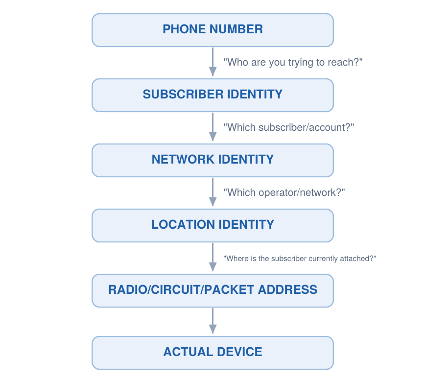
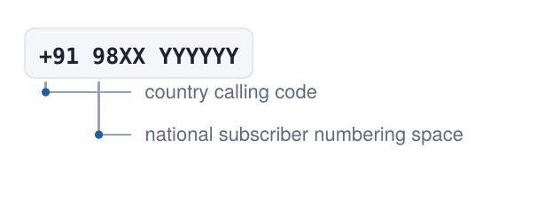
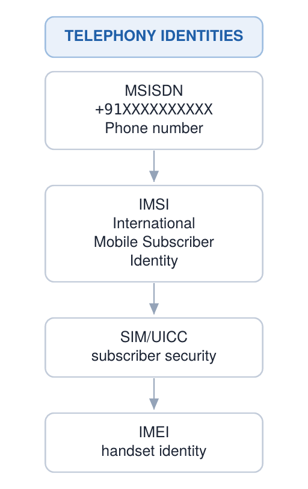
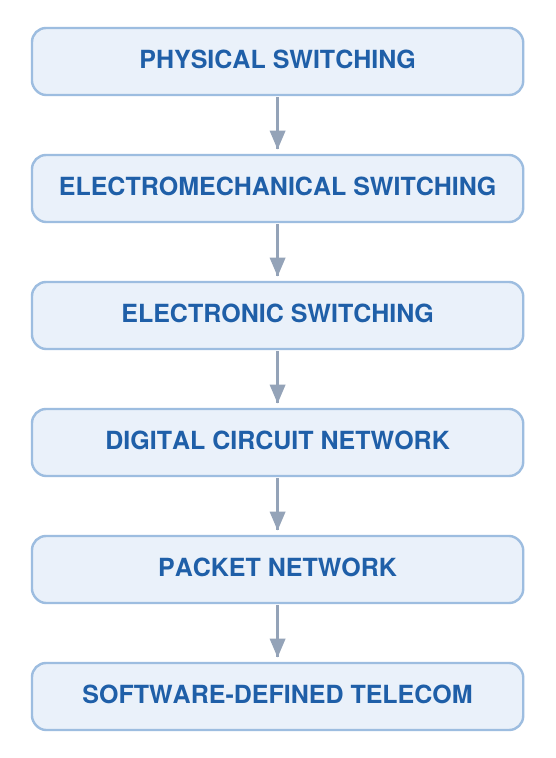
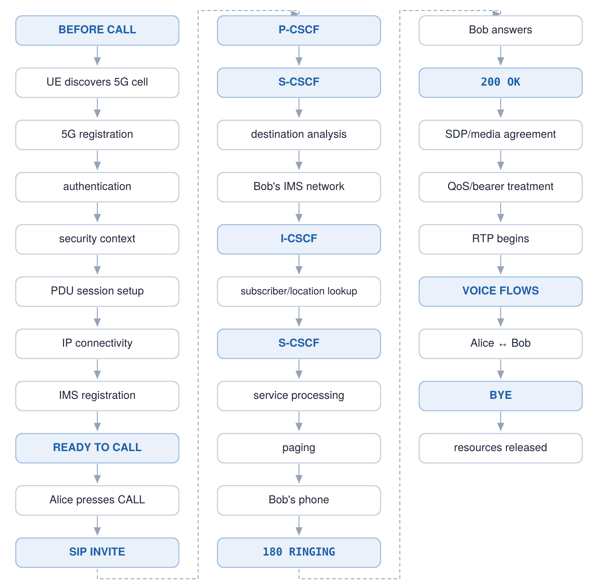
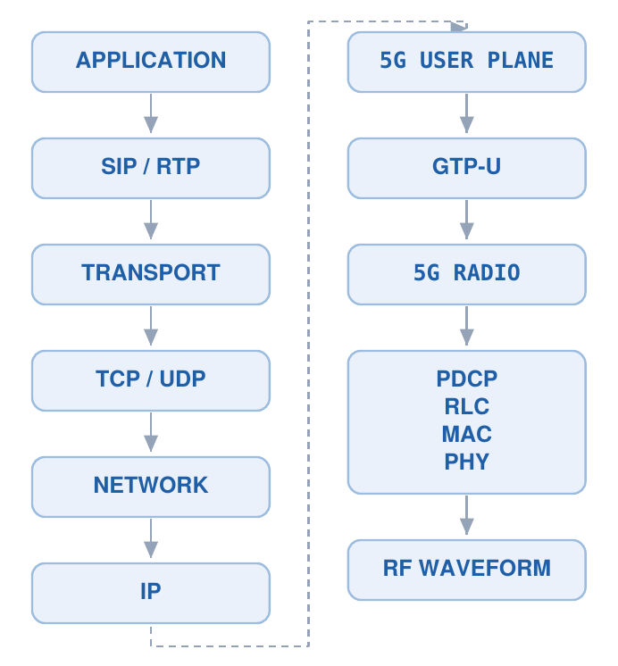
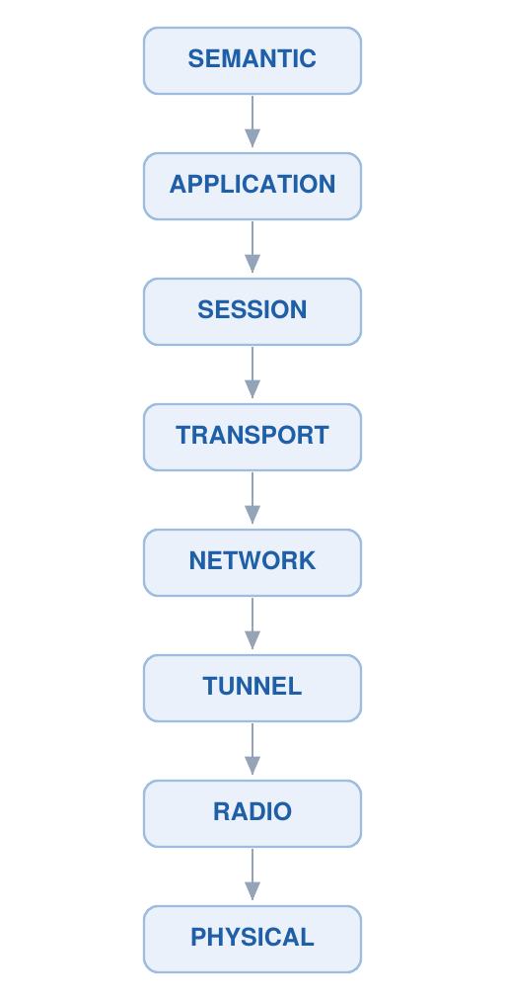
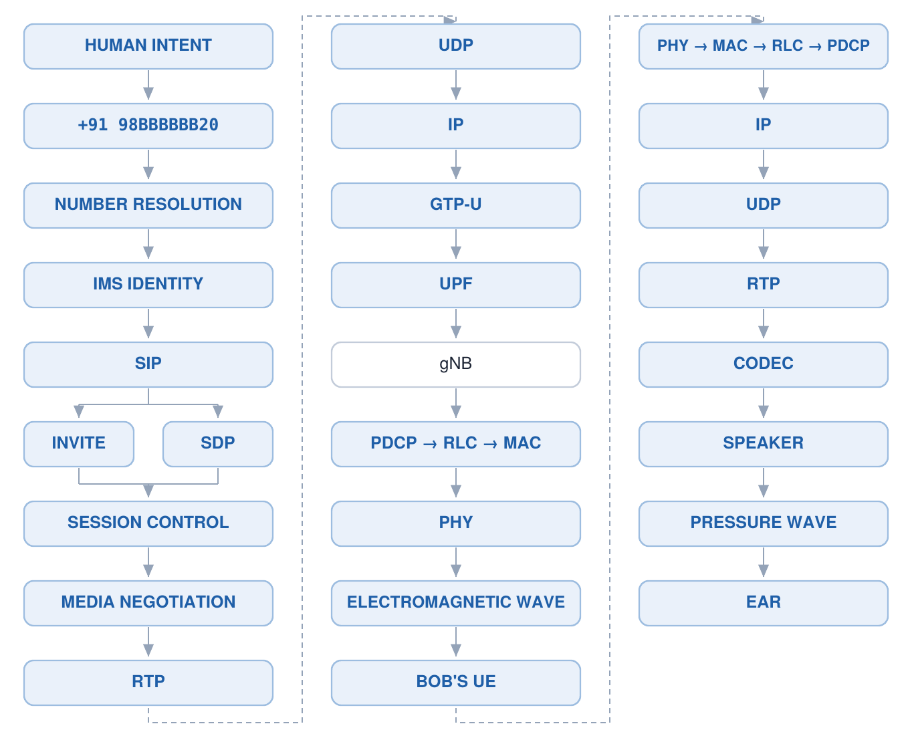

# The Anatomy of a Phone Number

**A telephone number is not an address. It never was.**

That single correction is what these three volumes are built around. A phone number does not
tell the network where you are, and it never did — not in 1892 when a Strowger switch counted
dial pulses, and not today when a 5G core resolves it through half a dozen databases before a
single bit of your voice moves. What the number actually does is name *you*, and everything
underneath is the machinery of turning that name into a location, then into a radio resource,
then into a pressure wave in someone's ear.

---

## The three volumes

| | Volume | What it covers | Pages | Figures |
|---|---|---|---|---|
| **I** | [The Architecture of a Phone Number](pdf/Part-1-Architecture-of-a-Phone-Number.pdf) | Numbering plans, the identity family, 150 years of switching | 77 | 77 |
| **II** | [Anatomy of a 5G Voice Call](pdf/Part-2-Anatomy-of-a-5G-Voice-Call.pdf) | One call, end to end: registration → INVITE → paging → RTP | 74 | 60 |
| **III** | [Packet-Level Telecommunications](pdf/Part-3-Packet-Level-Telecommunications.pdf) | SIP/SDP field by field, GTP-U, the radio stack, Wireshark | 67 | 53 |

Each volume is self-contained, has its own contents, list of figures and glossary appendix, and
descends one level further from the digits you type toward the electromagnetic wave.

---

## The one idea

Dialling a number starts a *resolution*, not a delivery. Each layer answers a different
question, and each answer is thrown away once the next layer has what it needs.



The number itself is structured, not arbitrary — a country code and a national significant
number, per ITU-T Recommendation E.164:



---

## Volume I — the number and its possessions

The number you give people is only one of four identities, and they are routinely confused.
Move your SIM to a different handset: the IMSI and MSISDN follow the subscription, the IMEI
stays with the phone.



Underneath, the machinery was rebuilt three times while the numbering plan barely moved:



**Covered:** E.164 and country-code allocation · MSISDN / IMSI / IMEI / ICCID · Strowger and
the number-as-instruction model · area codes and why they stopped meaning geography · number
portability · GSM and the HLR/VLR model · SS7 · the digital PSTN · VoIP, SIP and IMS · paging ·
numbering databases and who actually controls a number · emergency, toll-free and SMS as
overlaid services.

---

## Volume II — one call, end to end

Alice presses CALL. What follows is a distributed transaction across a dozen protocols, and
almost none of it is about audio. The call is *set up* long before any speech moves, and Bob's
phone has to be found before it can ring.



**Covered:** cell search and registration · authentication and the security context · PDU
sessions · IMS registration and the P/I/S-CSCF split · the SIP INVITE and destination analysis ·
inter-operator routing · why paging is not "call every tower" · codec negotiation and QoS ·
RTP · the 5G radio stack from PDCP to PHY · VoLTE vs VoNR vs PSTN breakout · roaming.

---

## Volume III — down to the wire

Every layer wraps the one above it and understands less about it. By the time anything reaches
the antenna, the telephone number does not exist on the wire at all — it was consumed during
signalling and never travels with the voice.




That progressive discarding of meaning is the architecture's central trick:



**Covered:** the SIP INVITE field by field · SDP and codec description · GTP-U tunnelling and
the TEID · PDCP / RLC / MAC / PHY · the RTP header, jitter and RTCP · encapsulation vs
segmentation · RRC, NGAP and SCTP · service-based architecture over HTTP/2 · reading it all in
Wireshark, and where the capture boundary hides the ciphertext.

---

## The whole thing, in one figure



---

## Repository layout

```
pdf/        the three volumes, print-ready A4
figures/    the nine figures used above (PNG for display, SVG sources in figures/svg/)
src/        the build pipeline (DOCX → structured model → SVG figures → PDF)
source/     the original source document
```

## Rebuilding the PDFs

The volumes are generated, not hand-laid-out. All 196 diagrams in the source were ASCII art;
the pipeline parses each into a graph model and re-renders it as vector artwork, so the figures
are regenerated from scratch on every build.

```bash
pip install -r src/requirements.txt
cd src
python parse2.py     # DOCX → items.json
python model.py      # → doc.json: parts, chapters, sections, diagram blocks
python render.py     # → three PDFs
```

The nine README figures are exported by `src/export_figures.py`, which writes both the SVG
sources and the PNGs the README embeds. PNG is used for display because GitHub serves `.svg`
from `raw.githubusercontent.com` as `text/plain`, so browsers will not render it inside an
`` tag — the SVGs are kept alongside for reuse and editing.

`figures.py` holds the diagram engine (flow chains, trees, annotation figures, protocol stacks);
`glossary.py` holds the glossary term list, scanned per volume so each appendix contains only
the terms that volume actually uses.

## Notes and caveats

- **Figure captions are generated** from each diagram's own first, middle and last node. They
  describe rather than interpret; editorial captions would be a manual pass.
- **Glossary definitions are written for this text**, not lifted from the standards. They
  describe the sense used here, not every sense a term carries elsewhere.
- Primary sources are the ITU-T E-series recommendations, the 3GPP TS 23.501 / 23.502 /
  24.229 series, and IETF RFCs 3261 (SIP), 4566 (SDP) and 3550 (RTP). Where the text cites a
  standard, go to the standard.
